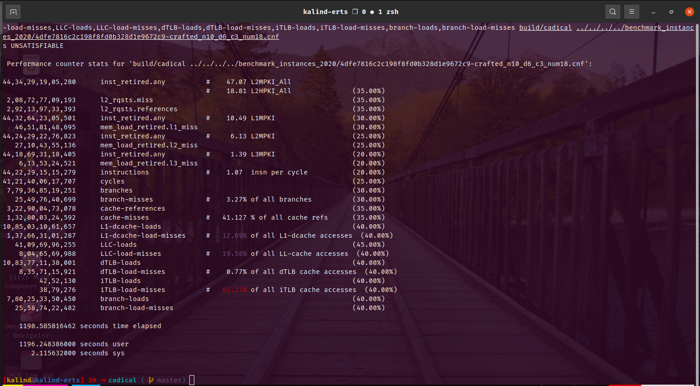

# cs773-project: Workload Characterization for SAT solvers

Welcome to this project repository!


## Procedure to validate the project results

### Setup to download benchmarks and SAT solvers

1. Locate the file `sc2020-main.uri` inside the `benchmark_instances_2020` directory. This file is downloaded from [SC 2020 Downloads page](https://satcompetition.github.io/2020/downloads.html) and consists of 400 URLs.

2. Download the 400 benchmark instances using the below command inside the `benchmark_instances_2020` directory.

   ```sh
   wget --content-disposition -i sc2020-main.uri
   ```

   This will download the benchmark files in `.cnf.xz` format.

3. Unarchive these benchmarks by running `unarchive_benchmarks.sh` file present in the root directory as follows:

   ```sh
   bash unarchive_benchmarks.sh benchmark_instances_2020
   ```

   This will extract all the benchmarks to their desirable format of `.cnf` which can be given to SAT solver as input.

   Out of the 400 files, following are the files of our interest in this project:

   ```spreadsheet
   .
   ├── 4dfe7816c2c198f8fd0b328d1e9672c9-crafted_n10_d6_c3_num18.cnf
   ├── 4f888358cd62fe7bc602ea6882cdfc6d-bivium-40-200-0s0-0x92fc13b11169afbb2ef11a684d9fe9a19e743cd6aa5ce23fb5-19.cnf
   ├── 7a5e40de64066f1886156ce2f6ad20fb-ncc_none_2_19_5_3_1_0_435991723.cnf
   ├── 897c9f5f6396aba631f6e78e675028a8-LABS_n038_goal002.cnf
   └── b14723fd0acbb7a5b497c4ddb4e3d813-sv-comp19_prop-reachsafety.queue_longer_false-unreach-call.i-witness.cnf
   ```

   You may remove or delete the other benchmark files.

4. The SAT solvers in Main Track of the competition were downloaded from this [link](https://baldur.iti.kit.edu/sat-competition-2020/sc2020-main-solvers.tar.xz). The solvers of our interest in this project are already built and present in the `sc2020-main-solvers` directory.

5. For the below SAT solvers, following table shows the path to their binary files w.r.t. the `sc2020-main-solvers` directory:

   |         SAT solver          | Path to binary file                               |
   | :-------------------------: | ------------------------------------------------- |
   |       CaDiCaL-sc2020        | `CaDiCaL-sc2020/build/cadical/build/cadical`      |
   |     cryptominisat-ccnr      | `cryptominisat-ccnr/bin/cryptominisat5_simple`    |
   |    Kissat-sc2020-default    | `Kissat-sc2020-default/build/kissat/build/kissat` |
   | Maple-LCM-Dist-alluip-trail | `Maple-LCM-Dist-alluip-trail/bin/glucose_static`  |

<br>

---

### Get the performance counter values using perf

1. Consider CaDiCaL-sc2020 solver for example, run the below command to get the required performance counter values. Run the command inside the directory: `sc2020-main-solvers/CaDiCaL-sc2020/build/cadical`

   ```sh
   perf stat -M Cache_Misses -e instructions,cycles,branches,branch-misses,cache-references,cache-misses,L1-dcache-loads,L1-dcache-load-misses,LLC-loads,LLC-load-misses,dTLB-loads,dTLB-load-misses,iTLB-loads,iTLB-load-misses,branch-loads,branch-load-misses build/cadical ../../../../benchmark_instances_2020/4dfe7816c2c198f8fd0b328d1e9672c9-crafted_n10_d6_c3_num18.cnf
   ```

   It will provide the output as shown below:

   <br>

   

   <br>

2. Various combination of SAT solvers and benchmark instances are taken and the performance counter values are generated. These values are documented in this [spreadsheet](https://docs.google.com/spreadsheets/d/1-h8eCcgP-Xzt2cDcxn1itea8N6V5yTaIOfWxsAZNic4/edit#gid=300939026) with the sheet named `perf_main_solvers_2020`. The benchmark instances were selected based on their file size assuming the input Boolean logic will be more complex for files with large sizes.

3. Based on the sum of L1, L2 and L3 MPKI values, the SAT solver + benchmark pairs are divided into 3 categories namely, `high` (highlighted in green), `med` (highlighted in blue) and `low` (highlighted in yellow). Here, high indicates more cache misses and low indicates comparatively less cache misses.

4. Next step is to generate traces for these 12 pairs of SAT solvers and benchmark instances.

<br>

---

### Run ChampSim on randomly generated traces

1. Trace files are generated using Intel's PIN tool by skipping **2 billion** instructions (this value is randomly chosen) and generating trace for next **250 million** instructions (again this value is randomly chosen). These files are present in the directory `random_pin_traces` on the CSE server, details are as below:

   IP address: `10.129.6.177`

   Username: `kalind`

   Password: `kalind123`

   Project root directory: `/home/kalind/cs773-project`

2. These trace files were simulated using ChampSim for **50 million** instructions after warmup of **50 million** instructions. The branch predictor used here is default: `bimodal`.

3. ChampSim results are present in the directory named `champsim_random_pin_traces_results`.

4. It was observed that the ChampSim results (added to the [spreadsheet](htthttps://docs.google.com/spreadsheets/d/1-h8eCcgP-Xzt2cDcxn1itea8N6V5yTaIOfWxsAZNic4/edit#gid=164618671) with sheet named `random_ChampSim_main_solvers_2020`) **did not** quite match with the `perf` output.

<br>

---

### Generate SimPoints for correct profiling of workload

1. The idea behind SimPoints is to capture the unique phase behavior that exists in programs. A phase is a region of execution when the program execution is stable - the program exhibits a relatively constant CPI, cache misses, etc.

2. The first step in this process involves slicing the dynamic execution trace into chunks of a fixed size. To identify these dynamic characteristics, the Basic Block Vectors (BBV) are created which contains the product of the number of times the basic block was executed and the number of instructions in that basic block. This is used to group similar slices together.

3. A representative slice is then chosen amongst them, which is called a simulation point or a ***SimPoint***.

4. To generate BBV we use a tool called `valgrind` that can be downloaded from this [link](https://sourceware.org/pub/valgrind/valgrind-3.20.0.tar.bz2). It will download the tar file of `valgrind-3.20.0`. Extract the archived file. And run the below commands:

   ```sh
   cd valgrind-3.20.0
   ./configure
   make
   sudo make install
   ```

   This will install the `valgrind` tool to the default path of `/usr/local/bin/valgrind`. If you wish to install it else where then run `./configure --prefix=/where/you/want/it/installed`.

   On the server, Valgrind tool is installed in the directory: `/home/kalind/cs773-project-downloads/valgrind-install`. This path is added to the environment variables in `.bashrc` file.

5. Now generate the BBV output file for a pair of SAT solver and benchmark instance. For example, run the command as shown below:

   ```sh
   valgrind --tool=exp-bbv --bb-out-file=bb-cadical-med.out ./build/cadical ../../../../benchmark_instances_2020/897c9f5f6396aba631f6e78e675028a8-LABS_n038_goal002.cnf &
   ```

   The default interval size is **100 million** instructions, which is a commonly used value. Other sizes can be used; smaller intervals can help programs with finer-grained phases. However smaller interval size can lead to accuracy issues due to warm-up effects.

   If you wish to change then provide the option `--interval-size=<number> [default: 100000000]` to the above command.

   Generate the BBV out files for each of the 12 pairs. These are already generated and are present in the `bbv-files` directory (inside the project's root directory) on the server.

6. Next is to download and build **SimPoint 3.2** tool. Download the source code from this [link](https://cseweb.ucsd.edu/~calder/simpoint/releases/SimPoint.3.2.tar.gz). The original source code won't be compiled directly due to some in-compatibilty of source code with the new version of gcc.

7. The directory with SimPoint executable after resolving the errors is present on the server at this path: `/home/kalind/cs773-project-downloads/SimPoint.3.2/bin/simpoint`.

8. Generate the `.simpoints` and `.weights` file for a pair of SAT solver and benchmark instance using the command below.

   ```sh
   ./simpoint -loadFVFile ~/Documents/cs773-project/bbv-files/bb-cadical-low.out -maxK 30 -saveSimpoints ~/Documents/cs773-project/simpoint_results/30K/cadical-low-30K.simpoints -saveSimpointWeights ~/Documents/cs773-project/simpoint_results/30K/cadical-low-30K.weights
   ```

   Each simulation point chosen is given as the number of the interval, starting with 0 (SimPoint 0 is instructions 1 - 100 million, for example). In addition, a weight is created for each simulation point, and shows the percent of the total program each simulation point represents.

   > **NOTE**
   >
   > If SimPoint chooses a number of clusters that is close to the maximum allowed, then it is possible that the maximum is too small. If this is the case and more simulation time is acceptable, it is better to double the maximum k and re-run the SimPoint analysis.
   >
   > For some pairs of SAT solver and benchmark instance, I had to generate simpoints with `maxK` as `60` or `120` as the number of clusters were very close to 30 or 60.

   The simpoint and weight files for each of the 12 combinations are generated and present at the `/home/kalind/cs773-project/simpoint_results` directory.

<br>

---

### Run ChampSim on generated traces using the knowledge of SimPoints

1. Trace files are generated using Intel's PIN tool by fast-forwarding the number of instructions based on the simpoints generated by the tool for a given pair of SAT solver and benchmark instance. Traces are generated for **100 million** instructions as that was the default interval size while generating the BBV file using `valgrind` tool.

2. The above process is automated by running the script `generate-simpoint-traces.py` located in the `scripts` directory. Make sure to define environment variables:

   - `$PIN_ROOT` - set to Pin tool installation directory (set to `/$HOME/cs773-project-downloads/pin-3.17-98314-g0c048d619-gcc-linux` on the server)
   - `$CHAMPSIM_ROOT` - set to the root of ChampSim directory (set to `$HOME/cs773-project-downloads/ChampSim` on the server)

   Then run the script as below from the `scripts` directory:

   ````sh
   python3 generate-simpoint-traces.py -s ../simpoint_results/60K/cadical-low-60K.simpoints -p ../sc2020-main-solvers/CaDiCaL-sc2020/build/cadical/build/cadical -b ..
   /benchmark_instances_2020/4dfe7816c2c198f8fd0b328d1e9672c9-crafted_n10_d6_c3_num18.cnf
   ````

   Based on the number of cores present on machine, the `line 29` above script has to be modified to spawn equal number of process for trace file generation, since these processes take very long to execute (nearly 11 to 12 hrs). Right now, it is set to length `3`. The script should be ran multiple times as long as all the simpoints for a given pair of SAT solver and benchmark instance are covered.

3. These files are present in the directory `simpoint_pin_traces` on the server. Due to limited time and less number of cores available, I could generate the traces for only two pairs named: `cadical-low-60K` and `cadical-med-30K`.

4. These trace files are then simulated using ChampSim for **100 million** instructions after warmup of **50 million** instructions. The branch predictor used here is: `hashed-perceptron` as it is the start-of-the-art branch predictor.

5. Simulation is carried out for all trace files present in a directory using a script named `run-champsim-simpoint-traces.py` located in the `scripts` directory to automate the process.

   Run the above script as below from the `scripts` directory:

   ```sh
   python3 run-champsim-simpoint-traces.py -t ../simpoint_pin_traces/cadical-med-30K/ -s ../champsim_simpoint_pin_traces_results/hash-perceptron-cadical-med-30K/
   ```

6. ChampSim results are present in the directory named `champsim_simpoint_pin_traces_results` for both pairs, `hash-perceptron-cadical-low-60K` and `hash-perceptron-cadical-med-30K`.

7. The ChampSim results are parsed using a script named `parse-champsim-results.py` which takes `.txt` file and outputs the parameters of interest on the stdout in the format to be pasted in the spreadsheet.

   Run the above script as below from the `scripts` directory. For example, we want to read the results for `17B` simpoint for `cadical-med-30K` pair.

   ```sh
   python3 parse-champsim-results.py -c ../champsim_simpoint_pin_traces_results/hash-perceptron-cadical-med-30K/cadical-med-30K-17B.txt
   ```

8. The weighted average are added to the [spreadsheet](https://docs.google.com/spreadsheets/d/1-h8eCcgP-Xzt2cDcxn1itea8N6V5yTaIOfWxsAZNic4/edit#gid=1670505810) with sheet named `SimPoint_ChampSim_main_solvers_2020`).

<br>

---